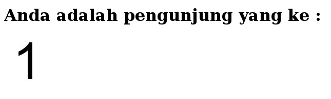
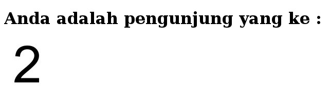

Belajar PHP Counter Dengan Gambar 
===
Ini adalah latihan counter menggunakan PHP. Nanti nya angka text akan diganti dengan gambar.

Step By Step
---
1. Buat folder projek pada **htdocs** atau **www** `php-counter-dg-gambar`
2. Buat sub folder untuk menampung gambar misal `angka` jadi folder lengkap nya `php-counter-dg-gambar/angka`
3. Buat code **index.php** script nya seperti ini :
```
<!DOCTYPE html>
<html>
<head>
	<title>Aplikasi PHP Counter</title>
</head>
<body>
<?php
$nilaicounter=("counter.txt");
$pengunjung=file($nilaicounter);
$pengunjung[0]++;
$bukafile=fopen($nilaicounter,"w");
fputs($bukafile,"$pengunjung[0]");
fclose($bukafile);
$angka = $pengunjung[0];
$panjang = strlen($angka);
echo "<h1>Anda adalah pengunjung yang ke :</h1>";
for ($i=0;$i<$panjang;$i++)
{ 
	# code...
	$pisah = substr($angka,$i,1).".jpg";
	echo '
</body>
</html>
``` 
4. Buat file *counter.txt* pertama kali script ini hanya berisi angka 1 , nanti nya setiap browser direload isi file akan berganti aritmetik dari 1 , 2 ,3 dst
```
1
```
4. Coba run di browser pada urlbar ketik `localhost/php-counter-dg-gambar`

5. Coba reload browser maka akan berganti 2 , reload lagi maka akan berganti 3 , dst
